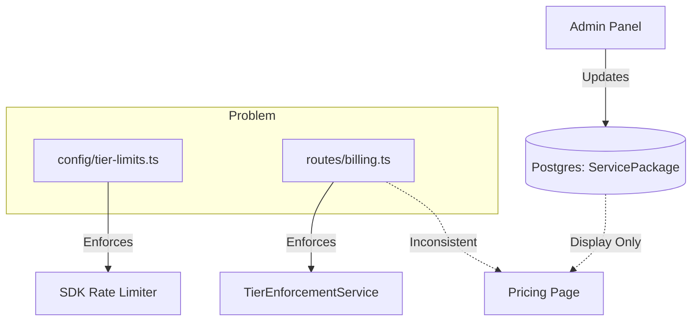

# Scout Report: Tier & SDK Configuration Architecture
**Date:** 2026-01-23
**Subject:** Centralized Tier/SDK Configuration System Research

## 1. Current Architecture Analysis

The current system suffers from **fragmented sources of truth** regarding tier limits and pricing.

### Sources of Truth (Conflict)
1.  **Backend Config A (`services/api/src/config/tier-limits.ts`)**:
    *   Defines SDK-focused limits: `requestsPerMinute`, `inboxesPerDay`, `maxApiKeys`.
    *   Used by: `api-rate-limiter.ts` (inferred).
2.  **Backend Config B (`services/api/src/routes/billing.ts`)**:
    *   Defines Feature-focused limits: `domains`, `inboxes`, `storageGB`, `apiAccess`.
    *   **Hardcoded** in `billingRoutes`.
    *   Used by: `TierEnforcementService` (checks `domains`, `inboxes`, `webhooks`).
3.  **Database (`ServicePackage` model)**:
    *   Stores `price`, `name`, `features` (JSON for display only).
    *   **Disconnect**: Changing a package in Admin panel updates the DB, but **NOT** the enforcement logic (which reads from Config B).
4.  **Frontend (`services/web/src/...`)**:
    *   `pricing-section.tsx`: **Hardcoded** UI text for landing page.
    *   `pricing-cards-section.tsx`: Fetches DB packages but uses **hardcoded** UI structure/checks for feature lists.

### Architecture Diagram (Current)


## 2. Gap Analysis

| Feature | Current State | Required State |
| :--- | :--- | :--- |
| **Source of Truth** | Split between 2 files + DB | **Single DB Source** (`ServicePackage.limits`) |
| **Admin Control** | Can change Name/Price only | Must control **Limits** (RPM, Storage, etc.) |
| **Frontend UI** | Hardcoded text | **Dynamic** rendering from API |
| **SDK Enforcement** | Config A (Static) | Dynamic based on Admin Config |
| **Sync** | None (Code deploy needed to change limits) | Real-time (Cache/DB driven) |

## 3. Recommended Approach: Centralization

Move all tier configurations into the Database (`ServicePackage` model).

### Database Schema Changes
Update `ServicePackage` in `schema.prisma`:
```prisma
model ServicePackage {
  // ... existing fields
  
  // New: JSON field to store strict enforcement limits
  limits  Json  @default("{}") 
  // Example: { "requestsPerMinute": 60, "maxDomains": 1, "apiAccess": true }
  
  // Keep: JSON field for display features (marketing text)
  features Json
}
```

### Migration Strategy
1.  **Seed**: Create a migration script to populate `ServicePackage.limits` using the current values from `routes/billing.ts` and `config/tier-limits.ts` (merged).
2.  **API**: Update `/billing/tiers` to return the DB-stored limits merged with package info.
3.  **Enforcement**: Refactor `TierEnforcementService` to:
    *   Accept `ServicePackage` data (cached).
    *   Remove hardcoded `TIER_LIMITS` constant.
    *   Fallback to default/free limits if package not found.
4.  **Frontend**: 
    *   Refactor `PricingSection` to map over API response instead of hardcoded components.
    *   Refactor `PackagesPage` (Admin) to allow editing `limits` JSON (or form fields).

## 4. List of Files to Modify

### Backend
*   `services/api/prisma/schema.prisma`: Add `limits` to `ServicePackage`.
*   `services/api/src/config/tier-limits.ts`: **DELETE** (Merge into DB/Service).
*   `services/api/src/routes/billing.ts`: Remove `TIER_LIMITS` constant; fetch from DB.
*   `services/api/src/services/tier-enforcement.service.ts`: Rewrite to use cached DB limits.

### Frontend
*   `services/web/src/pages/admin/PackagesPage.tsx`: Add form fields for Limits (RPM, Domains, etc.).
*   `services/web/src/pages/admin/packages-modules/PackageFormModal.tsx`: Update form UI.
*   `services/web/src/pages/landing-page-modules/pricing-section.tsx`: Rewrite to use dynamic data.
*   `services/web/src/components/settings/subscription-modules/pricing-cards-section.tsx`: Rewrite to use dynamic data.

## 5. API Changes Needed

### `GET /billing/tiers`
**Response:**
```json
{
  "tiers": [
    {
      "id": "STARTER",
      "name": "Starter",
      "price": 49000,
      "limits": {
        "requestsPerMinute": 300,
        "domains": 3,
        "inboxes": 20,
        "apiAccess": true,
        "maxWebhooks": 3
      },
      "features": ["3 Domains", "API Access"] // Display strings
    }
  ]
}
```

## Unresolved Questions
1.  **Caching Strategy**: Since limits are checked frequently (every API call), fetching from DB every time is slow. We should implement Redis caching or in-memory caching for `ServicePackage` limits.
2.  **Free Tier**: `ServicePackage` seems to track paid packages. How is "FREE" tier stored? **Recommendation:** Create a `ServicePackage` record with `price: 0` and `id: FREE`.

