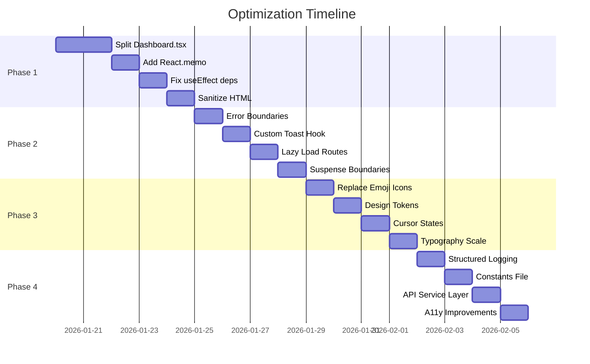

# Kế Hoạch Tối Ưu Codebase - Email Platform

> **Mode:** /plan:hard | **Date:** 2026-01-18 | **Status:** In Progress

## Executive Summary

Đánh giá codebase frontend (React 19 + Vite + TailwindCSS) theo skills `vercel-react-best-practices` và `web-design-guidelines`. Phát hiện 27 issues cần tối ưu, phân loại theo mức độ ưu tiên.

---

## 1. Phân Tích Hiện Trạng

### 1.1 Tech Stack
| Component | Version | Status |
|-----------|---------|--------|
| React | 19.2.0 | ✅ Latest |
| Vite | 7.2.4 | ✅ Latest |
| TailwindCSS | 3.4.17 | ✅ Good |
| React Router | 7.10.1 | ✅ Latest |
| Framer Motion | 12.23.26 | ✅ Good |

### 1.2 Codebase Metrics
- **Total Frontend LOC:** ~21,710 lines
- **Components:** ~95 files (.tsx)
- **Pages:** ~37 files
- **Hooks:** ~12 custom hooks
- **Largest file:** Dashboard.tsx (668 lines) ❌ Exceeds 200 LOC limit

---

## 2. Issues Phát Hiện

### 🔴 Critical (P0) - Performance & Core

| # | Issue | File(s) | Impact |
|---|-------|---------|--------|
| 1 | **Dashboard.tsx vượt 668 LOC** | `pages/Dashboard.tsx` | Context bloat, khó maintain |
| 2 | **Không dùng React.memo cho list items** | `EmailStream`, `MessageList` | Re-render không cần thiết |
| 3 | **useEffect dependencies không tối ưu** | `Dashboard.tsx:75,242` | Potential infinite loops |
| 4 | **Inline functions trong JSX** | Multiple pages | Re-create on each render |
| 5 | **iframe srcDoc với HTML động** | `Dashboard.tsx:549-570` | XSS risk, performance |

### 🟠 High (P1) - React Best Practices

| # | Issue | File(s) | Impact |
|---|-------|---------|--------|
| 6 | **Không có Error Boundaries granular** | App-level only | Crash toàn app khi lỗi |
| 7 | **react-hot-toast thay vì custom hook** | Multiple files | Không consistent với guidelines |
| 8 | **Thiếu Suspense boundaries cho data** | Dashboard, FocusDashboard | No loading states per section |
| 9 | **Landing page không lazy load sections** | `LandingPage.tsx` (382 LOC) | Initial bundle size |
| 10 | **Không có code splitting cho routes** | Public pages direct import | Bundle không tối ưu |

### 🟡 Medium (P2) - Design Guidelines

| # | Issue | File(s) | Impact |
|---|-------|---------|--------|
| 11 | **Emoji dùng làm icons (🔢)** | `Dashboard.tsx:526` | Unprofessional UI |
| 12 | **Inline styles mixed với Tailwind** | Multiple components | Inconsistent styling |
| 13 | **Thiếu cursor-pointer trên interactive** | Cards, list items | Poor UX feedback |
| 14 | **Hardcoded colors thay vì CSS vars** | `LandingPage.tsx` | Theme inconsistency |
| 15 | **Typography không consistent** | Various pages | Visual hierarchy unclear |

### 🟢 Low (P3) - Code Quality

| # | Issue | File(s) | Impact |
|---|-------|---------|--------|
| 16 | **Console.error thay vì proper logging** | `Dashboard.tsx:100,112` | No structured logging |
| 17 | **Magic numbers trong code** | PAGE_SIZE, timeouts | Hard to maintain |
| 18 | **Thiếu TypeScript strict patterns** | Some `any` types | Type safety gaps |
| 19 | **Duplicate API call patterns** | Multiple loaders | DRY violation |
| 20 | **Missing aria-labels** | Buttons, icons | A11y issues |

---

## 3. Kế Hoạch Tối Ưu

### Phase 1: Critical Fixes (Week 1) 🔴

#### 1.1 Split Dashboard.tsx (668 → <200 LOC each)
```
Dashboard.tsx →
├── components/dashboard/
│   ├── DashboardToolbar.tsx (~80 LOC)
│   ├── MessageListPane.tsx (~120 LOC)
│   ├── MessageDetailPane.tsx (~180 LOC)
│   ├── DashboardSearch.tsx (~50 LOC)
│   └── OTPHighlightCard.tsx (~60 LOC)
├── hooks/
│   ├── useDashboardData.ts (~100 LOC)
│   ├── useDashboardRealtime.ts (~50 LOC)
│   └── useMessageActions.ts (existing, enhance)
└── Dashboard.tsx (~150 LOC - orchestrator only)
```

#### 1.2 Add React.memo to List Items
```typescript
// Before
export function EmailItem({ message, onSelect }) { ... }

// After
export const EmailItem = React.memo(function EmailItem({
  message,
  onSelect
}: EmailItemProps) { ... });
```

#### 1.3 Fix useEffect Dependencies
```typescript
// Before - Dashboard.tsx:75
useEffect(() => {
    // ...logic using selectedInbox, messageSearch
}, [location.search, location.pathname, navigate, selectedInbox, messageSearch]);

// After - Stabilize with useCallback
const syncUrlParams = useCallback(() => { ... }, [navigate]);
useEffect(() => { syncUrlParams(); }, [location.search, syncUrlParams]);
```

#### 1.4 Sanitize HTML in iframe
```typescript
// Before - XSS vulnerable
srcDoc={`...${selectedMessage.htmlBody}`}

// After - Safe
import DOMPurify from 'dompurify';
srcDoc={`...${DOMPurify.sanitize(selectedMessage.htmlBody)}`}
```

### Phase 2: React Best Practices (Week 2) ✅ DONE [2026-01-18 02:44]

> **Metrics:** Build PASSED (3170 modules) | Tests 86/86 PASSED | Code Review 9/10

#### 2.1 Granular Error Boundaries ✅
```
App.tsx
├── ErrorBoundary (App-level - existing)
│   ├── PublicLayout
│   │   └── SectionErrorBoundary (new)
│   ├── MainLayout
│   │   └── FeatureErrorBoundary (new)
│   └── Dashboard
│       ├── ListErrorBoundary (new)
│       └── DetailErrorBoundary (new)
```

#### 2.2 Create Custom Toast Hook ✅
```typescript
// hooks/useAppToast.ts
export function useAppToast() {
  return {
    success: (msg: string) => toast.success(msg, { position: 'top-right' }),
    error: (msg: string) => toast.error(msg, { position: 'top-right' }),
    loading: (msg: string) => toast.loading(msg),
  };
}
```

#### 2.3 Lazy Load Landing Sections ✅
```typescript
// Before
import { Features } from "./pages/Features";

// After
const Features = lazy(() => import("./pages/Features"));
const Pricing = lazy(() => import("./pages/Pricing"));
const API = lazy(() => import("./pages/API"));
```

#### 2.4 Add Data Loading Suspense ✅
```typescript
// Dashboard with Suspense boundaries
<Suspense fallback={<MessageListSkeleton />}>
  <MessageListPane />
</Suspense>
<Suspense fallback={<MessageDetailSkeleton />}>
  <MessageDetailPane />
</Suspense>
```

### Phase 3: Design Guidelines (Week 3) 🟡

#### 3.1 Replace Emoji Icons
```typescript
// Before
<div className="...">🔢</div>

// After - Use Heroicons or Material Symbols
<span className="material-symbols-outlined text-2xl">pin</span>
// Or
<KeyIcon className="w-6 h-6" /> // from @heroicons/react
```

#### 3.2 Create Design Tokens
```css
/* index.css - Add missing tokens */
:root {
  --color-otp-bg: theme('colors.violet.500/10');
  --color-otp-border: theme('colors.violet.500/20');
  --radius-card: 1rem;
  --radius-button: 0.5rem;
}
```

#### 3.3 Add Cursor States
```typescript
// components/ui/interactive.css
.interactive-card {
  @apply cursor-pointer transition-all duration-200;
  @apply hover:scale-[1.01] hover:shadow-lg;
}

.interactive-list-item {
  @apply cursor-pointer;
  @apply hover:bg-nebula-elevated/50;
}
```

#### 3.4 Typography Scale
```css
/* Consistent typography */
.heading-1 { @apply text-3xl font-bold tracking-tight; }
.heading-2 { @apply text-2xl font-semibold; }
.heading-3 { @apply text-xl font-medium; }
.body-text { @apply text-base leading-relaxed; }
.caption { @apply text-sm text-nebula-text-muted; }
```

### Phase 4: Code Quality (Week 4) 🟢

#### 4.1 Structured Logging
```typescript
// utils/logger.ts
export const logger = {
  error: (ctx: string, err: Error, meta?: object) => {
    console.error(`[${ctx}]`, err.message, meta);
    // Future: Send to monitoring service
  },
  warn: (ctx: string, msg: string) => console.warn(`[${ctx}]`, msg),
  info: (ctx: string, msg: string) => console.info(`[${ctx}]`, msg),
};
```

#### 4.2 Constants File
```typescript
// constants/app.ts
export const PAGINATION = {
  MESSAGES_PER_PAGE: 20,
  INBOXES_PER_PAGE: 100,
  DOMAINS_PER_PAGE: 100,
} as const;

export const TIMEOUTS = {
  SEARCH_DEBOUNCE: 800,
  TOAST_DURATION: 4000,
  ANIMATION_FAST: 200,
} as const;
```

#### 4.3 API Service Layer
```typescript
// services/messageService.ts
export const messageService = {
  getMessages: (inboxId: string, params: MessageQueryParams) =>
    api<PaginatedResponse<Message>>(`/messages?${buildQuery(params)}`),

  markAsRead: (msgId: string, isRead: boolean) =>
    api(`/messages/${msgId}/read`, { method: 'PATCH', body: { isRead } }),

  delete: (msgId: string) =>
    api(`/messages/${msgId}`, { method: 'DELETE' }),
};
```

#### 4.4 A11y Improvements
```typescript
// Add to all icon buttons
<Button
  variant="ghost"
  size="icon"
  aria-label="Refresh messages"  // ← Add
  onClick={handleRefresh}
>
  <RefreshIcon />
</Button>
```

---

## 4. File Changes Summary

### New Files to Create
```
services/web/src/
├── components/dashboard/
│   ├── DashboardToolbar.tsx
│   ├── MessageListPane.tsx
│   ├── MessageDetailPane.tsx
│   ├── DashboardSearch.tsx
│   └── OTPHighlightCard.tsx
├── hooks/
│   ├── useDashboardData.ts
│   ├── useDashboardRealtime.ts
│   └── useAppToast.ts
├── services/
│   ├── messageService.ts
│   ├── inboxService.ts
│   └── domainService.ts
├── constants/
│   └── app.ts
├── utils/
│   └── logger.ts
└── components/
    ├── ErrorBoundary/
    │   ├── SectionErrorBoundary.tsx
    │   └── FeatureErrorBoundary.tsx
    └── skeletons/
        ├── MessageListSkeleton.tsx
        └── MessageDetailSkeleton.tsx
```

### Files to Modify
| File | Changes |
|------|---------|
| `Dashboard.tsx` | Split into modules, reduce to ~150 LOC |
| `LandingPage.tsx` | Lazy load sections, fix emoji icons |
| `App.tsx` | Add granular error boundaries, lazy imports |
| `index.css` | Add design tokens, typography scale |
| `AuthContext.tsx` | Minor - use logger instead of console |
| `EmailStream.tsx` | Add React.memo |
| `MessageList.tsx` | Add React.memo |

---

## 5. Metrics & Success Criteria

| Metric | Current | Target | Method |
|--------|---------|--------|--------|
| Largest file LOC | 668 | <200 | Split Dashboard |
| Initial bundle size | TBD | -20% | Lazy loading |
| Lighthouse Performance | TBD | >90 | All optimizations |
| Components with memo | ~5% | >50% | Add React.memo |
| A11y violations | TBD | 0 | aria-labels, roles |

---

## 6. Implementation Order



---

## 7. Risks & Mitigations

| Risk | Impact | Mitigation |
|------|--------|------------|
| Breaking changes during split | High | Incremental commits, test each step |
| Bundle size regression | Medium | Monitor with `vite-bundle-analyzer` |
| Style inconsistencies | Low | Visual regression tests |
| Missing edge cases | Medium | Maintain existing test coverage |

---

## 8. Unresolved Questions

1. **TanStack Query adoption?** - Codebase uses manual state + api calls. Should we migrate to TanStack Query for caching?
2. **State management?** - Currently using Context. Consider Zustand for complex state?
3. **i18n complete?** - Saw i18next setup but many hardcoded Vietnamese strings. Full i18n needed?

---

## Next Steps

1. ✅ User approval of plan
2. ✅ Phase 1 implementation (Critical Fixes)
3. ✅ Phase 2 implementation (React Best Practices) [2026-01-18 02:44]
4. ⏳ Phase 3 implementation (Design Guidelines)
5. ⏳ Phase 4 implementation (Code Quality)
6. ⏳ Performance testing
7. ⏳ Documentation update

---

*Generated by Claude Code | Skills: ui-ux-pro-max, frontend-development*
