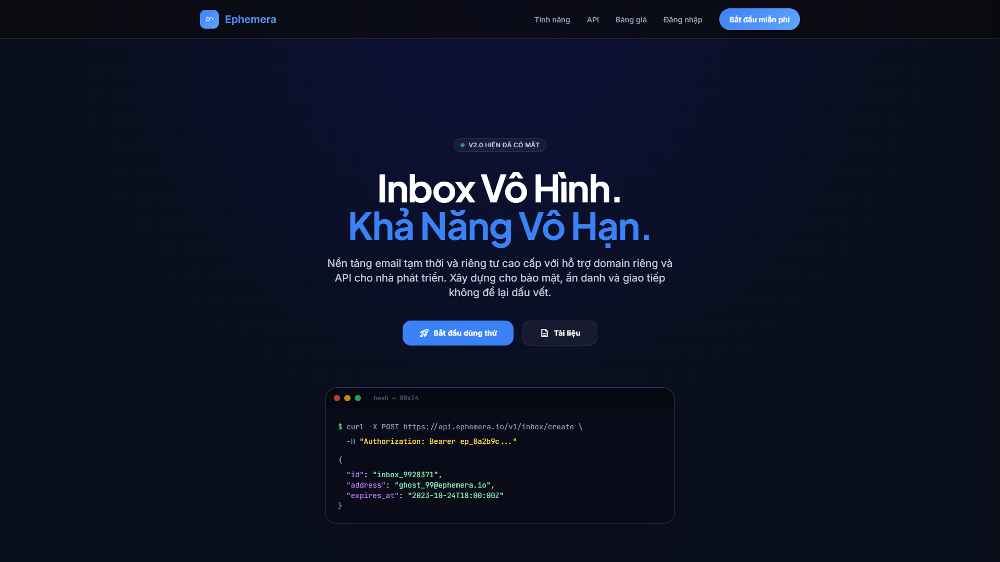
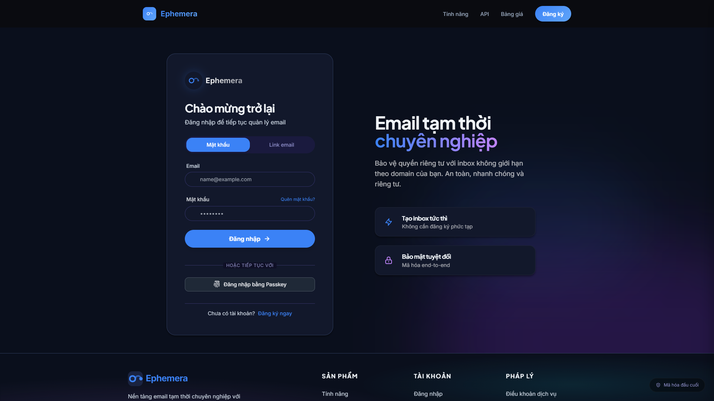
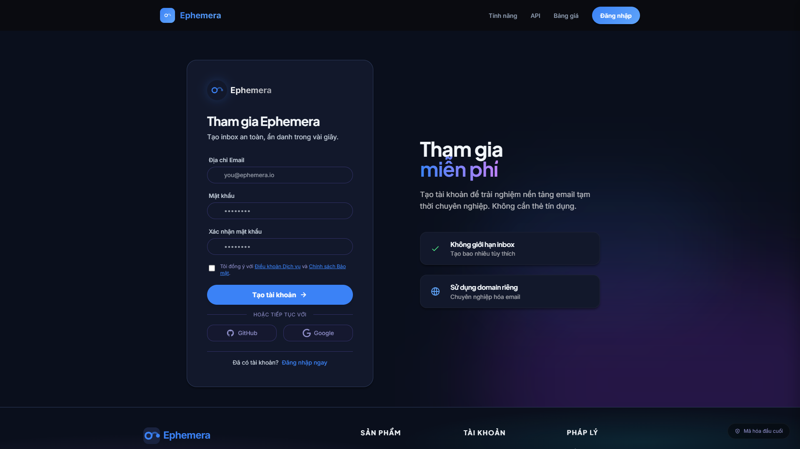
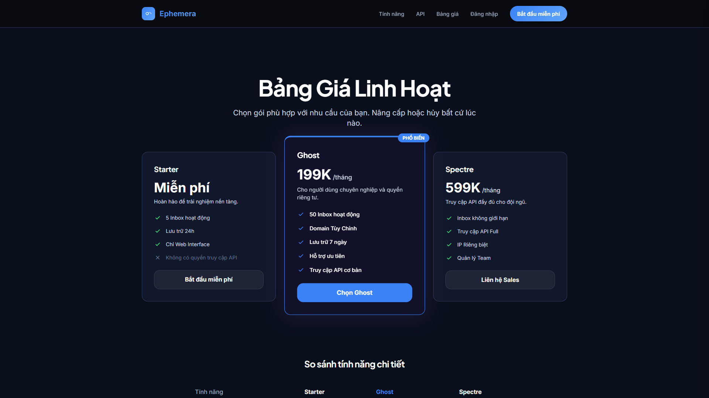

# UI Test Report - app.manhquy.click

**Date:** 2026-01-08 | **URL:** https://app.manhquy.click/

## Executive Summary

| Metric | Value |
|--------|-------|
| Overall Score | 7.2/10 |
| Pages Tested | 6 |
| Critical Issues | 3 |
| High Priority Issues | 4 |
| Console Errors | 0 |

## Performance Metrics

| Metric | Value | Status |
|--------|-------|--------|
| TTFB | 65.6ms | ✅ Excellent |
| FCP | 1388ms | ⚠️ Needs improvement |
| CLS | 0 | ✅ Excellent |
| JS Heap | 2.78MB | ✅ Good |
| DOM Nodes | 723 | ✅ Good |
| Network Requests | 19 | ✅ Good |

## Pages Tested

### 1. Homepage (Desktop)

**Scores:** Visual 8.0 | Layout 8.5 | Accessibility 6.5 | UX 7.5

**Findings:**
- Modern dark theme with professional appearance
- Strong visual hierarchy with blue accents
- Blue headline text has contrast issues against dark background

### 2. Login Page

**Scores:** Visual 7.5 | Layout 8.0 | Accessibility 5.5 | UX 6.0

**Findings:**
- Clean two-tab layout (Email/Link email)
- "Link email" tab naming unclear - should be "Magic Link"
- Purple accent color inconsistent with blue brand
- No visible focus states for keyboard navigation
- Missing loading indicator on form submit

### 3. Register Page

**Scores:** Visual 7.0 | Layout 7.5 | Accessibility 5.5 | UX 6.0

**Findings:**
- Similar issues to login page
- No inline validation feedback
- Password requirements not visible until error

### 4. Pricing Page

**Scores:** Visual 9.0 | Layout 9.0 | Accessibility 7.5 | UX 8.0

**Findings:**
- Best designed page with clear tier differentiation
- Good use of cards and visual separation
- Clear CTA buttons

### 5. Mobile Homepage

**Scores:** Visual 8.5 | Layout 9.0 | Accessibility 7.0 | UX 7.5

**Findings:**
- Good responsive adaptation
- Single-column flow works well
- Touch targets appear adequate

### 6. Mobile Login

**Scores:** Visual 8.0 | Layout 8.0 | Accessibility 6.0 | UX 5.5

**Findings:**
- Form inputs may be too small for touch
- Ensure 48x48px minimum touch targets

## Critical Issues (P0)

| # | Issue | Pages | Impact |
|---|-------|-------|--------|
| 1 | No focus states on interactive elements | All | Keyboard/screen reader users cannot navigate |
| 2 | Missing form validation feedback | Login, Register | Users get no error feedback |
| 3 | Text contrast failures | Homepage, Login | WCAG AA non-compliance |

## High Priority Issues (P1)

| # | Issue | Pages | Recommendation |
|---|-------|-------|----------------|
| 1 | No loading indicators | Login, Register | Add spinner on form submit |
| 2 | Small touch targets | Mobile Login | Ensure 48x48px minimum |
| 3 | "Link email" tab unclear | Login | Rename to "Magic Link" |
| 4 | Purple accent inconsistent | Login, Register | Use primary blue instead |

## Security Headers

| Header | Status |
|--------|--------|
| X-Frame-Options | ✅ SAMEORIGIN |
| X-Content-Type-Options | ✅ nosniff |
| Referrer-Policy | ✅ strict-origin-when-cross-origin |
| Cache-Control | ✅ no-cache, no-store |

## Quick Wins (Low Effort, High Impact)

1. **Add focus states** - CSS `:focus-visible` outline on all interactive elements
2. **Button hover states** - Add `hover:bg-blue-600` transitions
3. **Fix contrast** - Change blue headline to lighter shade or white
4. **Loading state** - Add spinner component to form buttons
5. **Rename tab** - "Link email" → "Magic Link"

## Recommendations Summary

### Immediate (This Sprint)
- Add focus-visible styles to all buttons/links
- Add loading spinner to auth forms
- Fix headline contrast ratio

### Short-term (Next Sprint)
- Implement inline form validation
- Standardize accent colors (remove purple)
- Add error/success toast notifications

### Long-term
- WCAG AA compliance audit
- Implement skeleton loading states
- Add keyboard shortcuts for power users

## Unresolved Questions

1. Is purple accent intentional for branding or inconsistency?
2. What is "Link email" tab behavior - magic link login?
3. Target WCAG compliance level (AA or AAA)?

---

*Report generated by Chrome DevTools automation*
